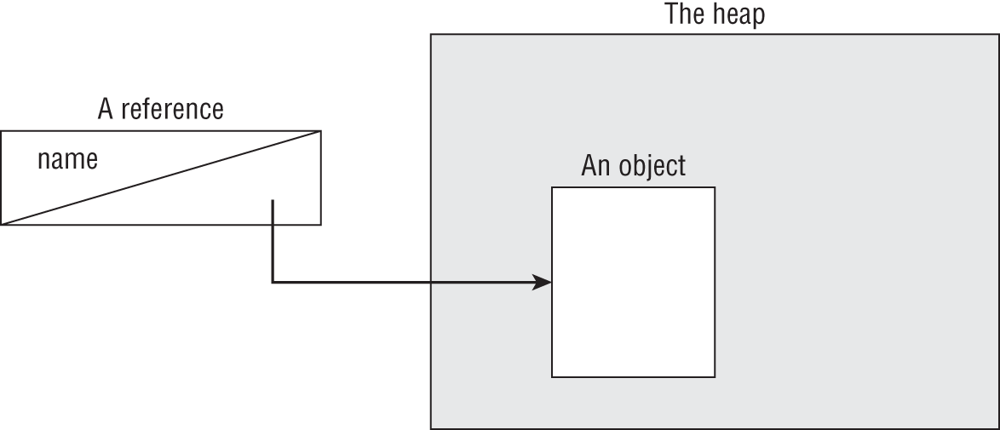

# Chapter 1: Building Blocks

### OCP Objectives

- Handling date, time, text, numeric and boolean values.

  - Use primitives and wrapper classes including Math API, parentheses, type promotion, and casting to evaluate arithmetic and boolean expressions.
- Utilizing Java Object Oriented Approach

  - Declare and instantiate Java objects including nested class objects, and explain the object life-cycle including creation, reassigning references, and garbage collection.
  - Understand variable scopes, use local variable type inference, apply encapsulation, and make objects immutable.

## JavaDoc Comment

```java
/**
 * Javadoc multiple-line comment
 * @author Jeanne and Scott
 */
```

This comment is similar to a multiline comment, except it starts with /**. This special syntax tells the Javadoc tool to pay attention to the comment.

## main() Method

### main() Method's Parameters

```java
public static void main(String[] args) {}
public static void main(String args[]) {}
public static void main(String... args) {}
public static void main(String... anyName) {}
public final static void main(final String[] args) {}
```

Above argument declarations are all valid.

## Understanding the Package Declarations and Imports

### Single-line Source-Code Launch

Instead of

```shell
javac Foo.java
java Foo
```

single-file program can be launched without javac command (omitting)

```shell
java Foo.java
```

### Wildcards

```java
import java.nio.*;            // NO GOOD - a wildcard only matches
                              // class names, not "file.Files"
 
import java.nio.*.*;          // NO GOOD - you can only have one wildcard
                              // and it must be at the end
 
import java.nio.file.Paths.*; // NO GOOD - you cannot import methods
                              // only class names
```

```java
import java.util.*;
import java.sql.*;  // causes Date declaration to not compile
```

Sometimes you really do want to use Date from two different packages. When this happens, you can pick one to use in the import statement and use the other's fully qualified class name. Or you can drop both import statements and always use the fully qualified class name.

```java
public class Conflicts {
       java.util.Date date;
       java.sql.Date sqlDate;
    }
```

### Compiling and Running Code with Packages

Java program can be compiled as either

```shell
javac packagea/ClassA.java packageb/ClassB.java
javac packagea/*.java packageb/*.java
```

And then, can be launched as

```shell
java packageb.ClassB
```

If we want our class files in a specific folder, -d folderName option can be used.

```shell
javac -d classes packagea/ClassA.java packageb/ClassB.java

java -cp classes packageb.ClassB
java -classpath classes packageb.ClassB
java --class-path classes packageb.ClassB
```

### Compiling with JAR Files

```shell
java -cp ".;C:\temp\someOtherLocation;c:\temp\myJar.jar" myPackage.MyClass
```

The period (.) indicates that you want to include the current directory in the classpath. The rest of the command says to look for loose class files (or packages) in someOtherLocation and within myJar.jar. Windows uses semicolons (;) to separate parts of the classpath; other operating systems use colons.

Just like when you're compiling, you can use a wildcard (*) to match all the JARs in a directory. Here's an example:

```shell
java -cp "C:\temp\directoryWithJars\*" myPackage.MyClass
```

### Creating a JAR File

```shell
jar -cvf myNewFile.jar .
jar --create --verbose --file myNewFile.jar .
jar -cvf myNewFile.jar -C dir .
```


| Option                      | Description                                             |
| ----------------------------- | --------------------------------------------------------- |
| -c,--create                 | Creates a new JAR file                                  |
| -v,--verbose                | Prints details when working with JAR files              |
| -f fileName,--file fileName | JAR filename                                            |
| -C                          | Directory containing files to be used to create the JAR |

## Creating Objects

### Literals and the Underscore Character

We can have underscores in numbers to make them easier to read:

```java
int million1 = 1000000;   // Normal
int million2 = 1_000_000; // Compiles

double notAtStart = _1000.00;          // DOES NOT COMPILE
double notAtEnd = 1000.00_;            // DOES NOT COMPILE
double notByDecimal = 1000_.00;        // DOES NOT COMPILE
double annoyingButLegal = 1_00_0.0_0;  // Ugly, but compiles
double reallyUgly = 1__________2;      // Also compiles
```

## Understanding Data Types

### Distinguishing between Primitives and Reference Types

Reference types can be assigned null, which means they do not currently refer to an object. Primitive types will give you a compiler error if you attempt to assign them null. In this example, value cannot point to null because it is of type int:

```java
int value = null;   // DOES NOT COMPILE
String name = null; // Compiles
```

But what if you don't know the value of an int and want to assign it to null? In that case, you should use a numeric wrapper class, such as Integer, instead of int.

### Defining Text Blocks

A text block starts and ends with three double quotes ("""), and the contents don't need to be escaped. This is much easier to read. Notice how the type is still String. This means the methods you learn about in Chapter 4 for String work for both a regular String and a text block.

Text blocks require a line break after the opening """, making this one invalid. Now let's try a valid one. How many lines do you think are in this text block?

```java
String block = """doe"""; // DOES NOT COMPILE
```

```java
String block = """
   "doe\"\"\"
   \"deer\"""
  """;
System.out.print("*"+ block + "*");

/*
Prints: 
-------------
* "doe"""
 "deer"""
*
-------------
*/
```

## Declaring Variables

- Identifiers must begin with a letter, a currency symbol ($, € etc.) or a _ symbol.
- Identifiers can include numbers but not start with them.
- A single underscore _ is not allowed as an identifier.
- Names stored for Java cannot be used as an identifier.

Some illegal examples:

```java
int 3DPointClass;    // identifiers cannot begin with a number
byte hollywood@vine; // @ is not a letter, digit, $ or _
String *$coffee;     // * is not a letter, digit, $ or _
double public;       // public is a reserved word
short _;             // a single underscore is not allowed
```

Multiple variables can be initialized in the same statement.

```java
void sandFence() {
   String s1, s2;
   String s3 = "yes", s4 = "no";
}
```

```java
void paintFence() {
   int i1, i2, i3 = 0; // i3's value is 0 but i1 and i2 are not initialized
}
```

BUT...

```java
int num, String value; // DOES NOT COMPILE
```

## Initializing Variables

### Inferring the Type with *var*

The formal name of this feature is local variable type inference. It can only be used for local variables. Instance variables cannot be *var*, SO...

```java
public class VarKeyword {
    var tricky = "Hello"; // DOES NOT COMPILE
}
```

When *var* is used, the compiler is instructed to determine the type.

```java
public void reassignment() {
    var number = 7;
    number = 4;
    number = "five"; // DOES NOT COMPILE, equivalent to int number = "five";
}
```

Additionally,

```java
public void doesNotCompile() {
    var a; // DOES NOT COMPILE
    a = 1;
}
```

*var* cannot be used without initialization.

```java
public void compiles(boolean check) {
    var a = check ? 1 : 2; // COMPILES
}
```

Above, *var* variable is initialized in the same line, so it compiles.

```java
public void twoTypes() {
    int a, var b = 3; // DOES NOT COMPILE
    var n = null;     // DOES NOT COMPILE  
}
```

Since same line declarations cannot be as type and variable names, first line does not compile, even it would be *int* instead of *var*. Also, *var* variable cannot be initialized as *null*. Because compiler cannot be aware of the variable's type, it can only be *Object* but the intention of *var* is not determine the variable type as *Object*.

However, a *var* type variable can be reassigned as *null*. Because its type is already determined by compiler while initialization at the first place.

```java
public int addition(var a, var b) { // DOES NOT COMPILE
   return a + b;
}
```

*var* type can only be used for local variables, not for method parameters or instance variables.

NOTE: *var* is not a reserved word so it can be used as a variable name.

```java
public class Var {
    public void var() {
        var var = "var";
    }
}
```

Above code compiles.

Once you start having code that looks like the following, it is time to consider using var:

```java
PileOfPapersToFileInFilingCabinet pileOfPapersToFile =  
       new PileOfPapersToFileInFilingCabinet();
```

This can be shortened by using *var* without losing any information as,

```java
var pileOfPapersToFile = new PileOfPapersToFileInFilingCabinet();
```

## Managing Variable Scope

### Limiting Scope

When you see a set of braces ({}) in the code, it means you have entered a new block of code. Each block of code has its own scope. When there are multiple blocks, you match them from the inside out.

```java
public void eatIfHungry(boolean hungry) {
    if (hungry) {
        int bitesOfCheese = 1;
        {
            var teenyBit = true;
            System.out.println(bitesOfCheese);
        }
    }
    System.out.println(teenyBit);  // DOES NOT COMPILE
}
```

## Destroying Objects

All Java objects are stored in your program memory's heap. The heap, which is also referred to as the free store, represents a large pool of unused memory allocated to your Java applications.

### Understanding the Garbage Collector

Garbage collector refers to the process of automatically freeing memory on the heap by deleting objects no longer reachable in the program.

As a develoeper, the most interesting part of garbage collection is determining when the memory belonging to an object can be reclaimed. In java and other languages, eligible for garbage collection refers to an object's state of no longer being accessible in a program and therefore able to be garbage collected.

It does not mean an unreachable object will be garbage collected immediately.

Java includes a built-in method to help support garbage collection where it can be suggested that garbage collection run.

```java
System.gc();
```

However, Java is free to ignore this call. This method is not guaranteed to do anything.

### Tracing Eligibility

The JVM waits patiently and monitors each object until it determines that the code no longer needs that memory. An object will remain on the heap until it is no longer reachable. An object is no longer reachable when on of two situations occurs:

- The object no longer has any references pointing to it.
- All references to the object have gone out of scope.

#### Objects vs References

Do not confuse a reference with the object that it refers to; they are two different entities. The reference is a variable that has a name and can be used to access the contents of an object. A reference can be assigned to another reference, passed to a method, or returned from a method. All references are the same size, no matter what their type is.

An object sits on the heap and does not have a name. Therefore, you have no way to access an object except through a reference. Objects come in all different shapes and sizes and consume varying amounts of memory. An object cannot be assigned to another object, and an object cannot be passed to a method or returned from a method. It is the object that gets garbage collected, not its reference.



BTW...

Not all questions will include package declarations and imports. Don't worry about missing package statements or imports unless you are asked about them. The following are common cases where you don't need to check the imports:

- Code that begins with a class name
- Code that begins with a method declaration
- Code that begins with a code snippet that would normally be inside a class or method
- Code that has line numbers that don't begin with 1

You'll see code that doesn't have a method. When this happens, assume any necessary plumbing code like the main() method and class definition were written correctly. You're just being asked if the part of the code you're shown compiles when dropped into valid surrounding code. Finally, remember that extra whitespace doesn't matter in Java syntax. The exam may use varying amounts of whitespace to trick you.